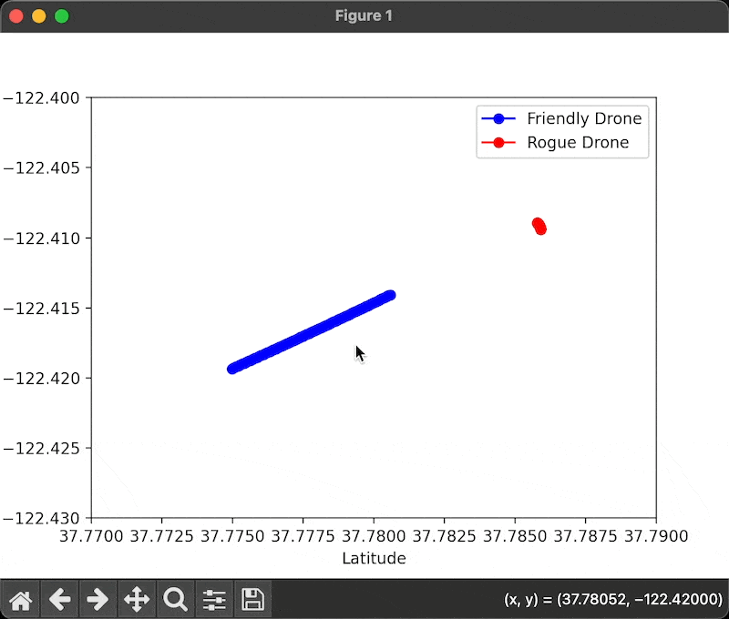
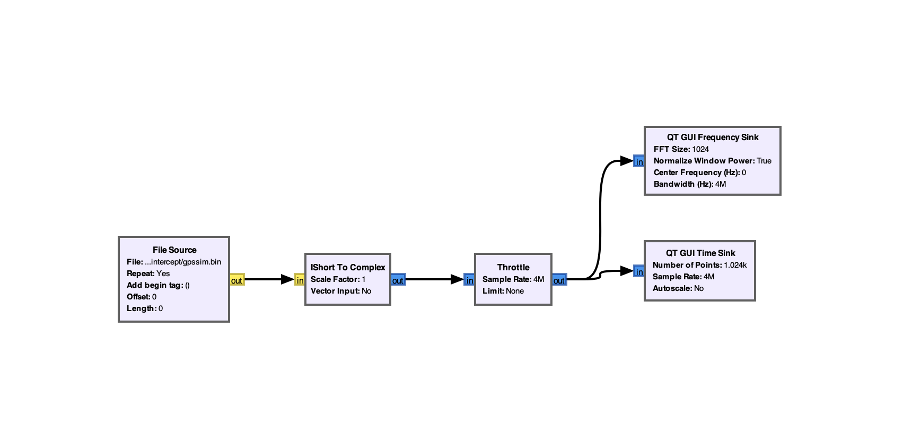
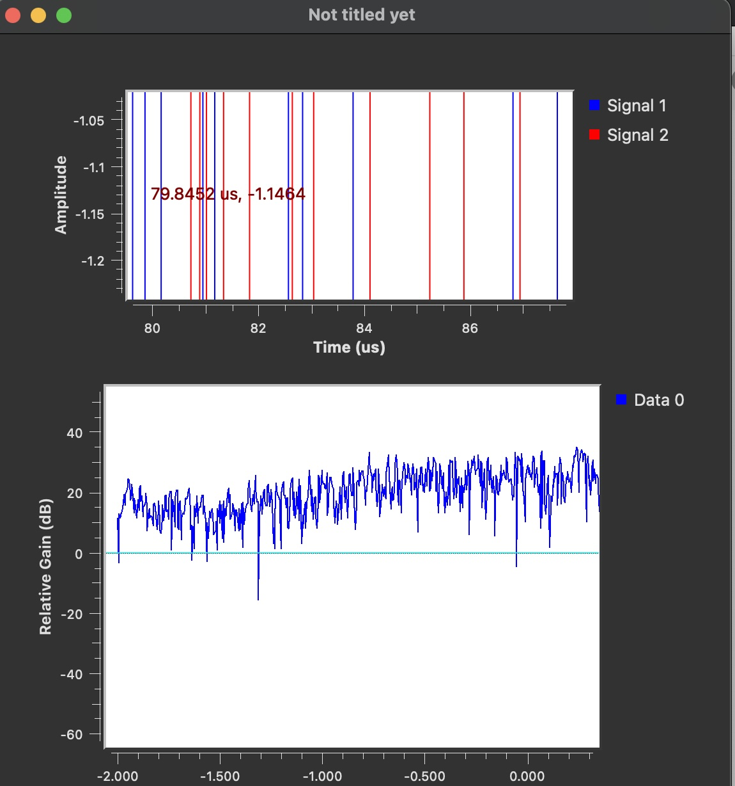

# RF Crash Courses

- [RF Crash Courses](#rf-crash-courses)
  - [Overview](#overview)
  - [Resources](#resources)
    - [Resource Overview](#resource-overview)
    - [Learning Resources](#learning-resources)
    - [Tools I'd Recommend Learning](#tools-id-recommend-learning)
  - [GNSS Crash Course + Project](#gnss-crash-course--project)
    - [Objective](#objective)
    - [Game Plan](#game-plan)
    - [BS Pre-Requisities](#bs-pre-requisities)
      - [Install GNSS](#install-gnss)
      - [Install GNU Radio](#install-gnu-radio)
      - [Using GNU Radio with GNSS SDR](#using-gnu-radio-with-gnss-sdr)
    - [Project](#project)
      - [Downloading and Preparing The Data](#downloading-and-preparing-the-data)
      - [Convert RINEX Data to Baseband Signal](#convert-rinex-data-to-baseband-signal)
      - [Processing Data Using GNSS](#processing-data-using-gnss)
      - [Visualizing The Data](#visualizing-the-data)
    - [Project: Autonomous Drone Interception Using GNSS and SDR](#project-autonomous-drone-interception-using-gnss-and-sdr)
      - [Overview](#overview-1)
      - [Data Generation](#data-generation)
      - [GNSS-SDR Configuration](#gnss-sdr-configuration)
        - [Signal Processing Blocks in GNSS-SDR:](#signal-processing-blocks-in-gnss-sdr)
        - [Down The Line Implimentations](#down-the-line-implimentations)
      - [Drone Simulation In Python](#drone-simulation-in-python)
      - [Control Algorithm For The Drone](#control-algorithm-for-the-drone)
      - [Simulation on GNU Radio](#simulation-on-gnu-radio)
  - [Performance Testing Of GNSS-SDR](#performance-testing-of-gnss-sdr)
    - [Generate the GPS Simulation Data](#generate-the-gps-simulation-data)
    - [Run GNSS-SDR](#run-gnss-sdr)

## Overview
I've decided to teach myself the basics of Radio Communication over a ~~weekend~~ (it was originally meant to be a weekend but I decided I wanted to spend a bit more time doing it) and this mainly serves as a repository of what were pretty good learning resources for me. 

My notes are slightly repetitive of the original content but I've written them so that they are easy to skim. 

The current lay of the land is that these notes are sorted by the resource they're made from, but what I would like to do once I'm done going through all the sources is to make a list of 'master' notes (ie. cross-resource notes which accompass everything I've learnt). 

I don't think these things are worth memorizing but I do think these set of notes are worth going over a few times to develop familiarity with the content. One thing which I'm realising as I go along with these courses is that it makes a ton of sense to grab a simulator and play around with it (especially the E&M stuff). 

I'm currently using the [issues](https://github.com/ArlinJae/RF/issues) page as a dumping ground of the links I'm coming across. If and when I use them to study, I will add them to the master resource list. 

## Resources

### Resource Overview
While doing this learning, I would try and optimize for an understanding of a few broad areas. 

1. Basics of RF
2. Antenna/ System Design
3. Digital Signals Processing
4. GNU Radio (+ Unix python/ cpp)

### Learning Resources

- `-` Represents to-do
- `+` Represents covered
- `!` Represents doing

The order in which I'm mentioning these are the orders in which I'm planning on going through these. 

| Completed | Resource | Creator | Type | Time Taken (hours) | Notes |
|---|---|---|---|---|---|
| + | [Intro To Antenna Basics](https://www.youtube.com/playlist?list=PL_tws4AXg7authztKFg5ZN5qWGtq3N_nI) | Hackaday | Theory/AntennaDesign | 6 | [Notes](!_Intro_To_Antenna_Basics.pdf) |
| ! | [Radio System Design](https://youtube.com/playlist?list=PLGF140BA5wtWgW9bAd6DtF3MaYbhPtFwd&si=Bu5R834sA-UY8G6g) | Dr David S. Ricketts | Theory/ Introduction | 4 | [Notes](!_Radio_System_Design.pdf)/ TBC |
| ! | Transmission Lines | Dr Simarjeet Saini | Theory/Advanced | 10 | - |
| ! | [Opencourseware: Digital Signals Processing](https://ocw.mit.edu/courses/res-6-008-digital-signal-processing-spring-2011/) | MIT Open Courseware | Theory/ Digital Signal Processing | 7 | - |
| ! | [SDR](https://greatscottgadgets.com/sdr/) | Great Scott Gadgets | Practical/ SDR | - | - |
| ! | [GNU Radio Companion Guide](https://www.youtube.com/watch?v=ufxBX_uNCa0) ([#2](https://www.youtube.com/watch?v=m0GGBFBWFfU)) | Hackaday | Practical/ GNU Radio | 2 | - |
| - | [Intro To RF Basics](https://www.youtube.com/playlist?list=PLHiqssciYZ4g6eZxJzTUwrMZ_1YeqLH6W) | Mark Watson | Theory/Introduction | - |
| - | [RF/ Antenna Fundamentals Fundamentals](https://www.youtube.com/playlist?list=PLYLLZZmhkxwGMCROhyxopDUOPvD9K6J3wy) | Hank Ottey | Theory/Introduction | - |
| - | [Intro To Radar Systems (MIT Lincoln Lab)](https://www.youtube.com/playlist?list=PLUJAYadtuizA8RC2Qk8LfmiWA56HZsk9y) | Dr. Robert M. O'Donnell | Theory/Radar | - |
| - | [Wireless Communications (IIT-D)](https://www.youtube.com/playlist?list=PL33AB52ED9A7873C0) | Dr.Ranjan Bose | Theory/Advanced | - |


### Tools I'd Recommend Learning
| Tool                                                                | Use                                   | Notes |
| ------------------------------------------------------------------- | ------------------------------------- | ----- |
| [CENOS](https://www.cenos-platform.com/)                            | Simulation/RF                         | -     |
| [Ansys HFSS](https://www.ansys.com/products/electronics/ansys-hfss) | Simulation/HF                         | -     |
| [bladeGPS](https://github.com/osqzss/bladeGPS)                      | Real-Time Signal Generation (BladeRF) | -     |
| [OpenTsiolkovsky](https://github.com/istellartech/OpenTsiolkovsky)  | Rocket Flight Simulator               | -     |
| [GNSS-SDRLIB](https://github.com/taroz/GNSS-SDRLIB)                 | SDR-Toolkit                           | -     |
| [GPS-SDR-SIM](https://github.com/osqzss/gps-sdr-sim]                | Synthetic GPS Signal Generator        | -     |


## GNSS Crash Course + Project

### Objective
* Get comfortable with GNSS systems
* Aim to build a GNSS Recieve Chain
* Run, Sample, Cross-Compile on ARM
* Aiming to use GNSS SDR as a GPS Receiving Software

### Game Plan
- [x] Go through GNSS Documentation + Example Tutorials
- [x] Go through [GNSS-SDRLIB](https://github.com/taroz/GNSS-SDRLIB) [^1]
- [x] Build out documentation for simple GNSS projects
- [x] Build out project with GNU Radio + GNSS SDR

[^1]: Designed for Windows infrastructure - see if I can find something similar for Linux/Unix.

### BS Pre-Requisities

#### Install GNSS
```bash
brew update && brew upgrade
brew install armadillo cmake hdf5 gnuradio libmatio openssl pkg-config protobuf pugixml
brew install --cask mactex  # when completed, restart Terminal
brew install graphviz doxygen
pipx install mako
git clone https://github.com/gnss-sdr/gnss-sdr
cd gnss-sdr/build
cmake ..
make
sudo make install
make doc # Honestly useless - use online documentation instead, much better
open ./docs/html/index.html
```

#### Install GNU Radio
Already have this downloaded but just in case - 
```
brew install gnuradio
gnuradio-companion
```

There’s a [bug](https://github.com/ryanvolz/radioconda/issues/86) which doesn’t allow me to choose a python editor in GNURadio but that seems to be a mac centric problem. 

#### Using GNU Radio with GNSS SDR
After setting up your flowgraph, you can run GNSS-SDR with a configuration file that specifies your SDR hardware and processing parameters.

Config file - 

```
[GNSS-SDR]
GNSS-SDR.internal_logging = True

[INPUT]
InputType = file
FileName = /path/to/your/gnss/data/file.dat
```

(For real-time monitoring with an RTL-SDR, HackRF or USRP, you have to set `InputType = stream`. 


### Project

The canadian government has publically accessible [GNSS data](https://open.canada.ca/data/en/dataset/74f2472e-5bb9-4d2d-8be5-0931c96eeeff) which I thought would be fun to play around with since I didn’t have any SDR hardware with me. 

#### Downloading and Preparing The Data

I wrote a [script](cnd_gov_gnss/download.sh) which downloaded and extracted the RINEX from a directory. 

From the looks of it the server had the following file structure (the gov website says there's a pdf which has this all documented but that file was misliked and not accessible so I had to play around with it and make my own link tree - 
```
ftp.mrn.gouv.qc.ca/GPS
├── Caplan/
├── Chibougamau/
├── Chicoutimi/
├── Gaspe/
├── Gatineau/
├── HavreStPierre/
├── LaTuque/
├── Mont-Laurier/
├── Montreal/
│   ├── mon20381/
│   │   ├── mon20381a.zip
│   │   │   ├── mon20381a.24G
│   │   │   ├── mon20381a.24L
│   │   │   ├── mon20381a.24N
│   │   │   ├── mon20381a.24O
│   │   ├── mon20381b.zip
│   │   ├── mon20381c.zip
│   │   ├── ...
│   ├── mon20382/
│   │   ├── mon20382a.zip
│   │   ├── mon20382b.zip
│   │   ├── mon20382c.zip
│   │   ├── ...
│   ├── ...
├── Quebec/
├── R-du-Loup/
├── Rimouski/
├── Rouyn/
├── Sept-iles/
├── Sherbrooke/
├── St-Georges/
├── SteAnneDesMonts/
├── Trois-Rivieres/
└── <bunch of logs>
```
Basically, the server has a directory for each station, which contained (what I'm assuming is) subdirectory for each of the past 366 days (this assumption alligns with the information on the gov's website). 

Each of these days has subdirectories with the name `nameofdir[a,b,c,..x]` on it. This confused me at first but I did some googling and I found that it was the observation session for the day - 
```
a : 00:00 - 00:59 UTC
b : 01:00 - 01:59 UTC
...
```

When you open one of these zips, they have 4 RINEX files (`YY` stands for the year) - 
```
.YYO: Observation file
.YYN: Navigation file for GPS
.YYG: Observation file for GPS
.YYL: Observation file for GLONASS
```

#### Convert RINEX Data to Baseband Signal
I had to get an external tool called [georinex](https://github.com/geospace-code/georinex) (download using `pip install georinex`) to convert my RINEX data which I got through script and convert it into baseband signals. 

```python

import georinex as gr
import os

input_dir = './gnss_data/MON2'
output_dir = './gnss_data/baseband'

if not os.path.exists(output_dir):
    os.makedirs(output_dir)

for root, dirs, files in os.walk(input_dir):
    for file in files:
        if file.endswith('.24O'):
            input_file = os.path.join(root, file)
            output_file = os.path.join(output_dir, os.path.splitext(file)[0] + '.dat')
            data = gr.load(input_file)
            data.to_netcdf(output_file)
            print(f'Converted {input_file} to {output_file}')
```

I used a script to do this, but all the script did was iteratively call `gr-rinex -i inputfile.rnx -o outputfile.dat` while dynamically changing the output file name depending on the file name. 

#### Processing Data Using GNSS

This step took me about 15-20 minutes to do because I kept messing up the configuration. Putting the config file in the right directory seemed to somehow matter even though I was trying to put the relatively directory of the config file into the bash command. 

What finally worked for me was having this in my config file. 
```
[GNSS-SDR]
GNSS-SDR.internal_fs = 16e6
GNSS-SDR.internal_source = file
GNSS-SDR.input_file_name = "outputfile.dat"
GNSS-SDR.input_file_type = float32
GNSS-SDR.signal_type = "L1"

[GPS]
GPS.enable = true
GPS.L1.IF = 4.1304e6
GPS.L1.SIGNAL = true

[GLONASS]
GLONASS.enable = true
GLONASS.L1.IF = 4.0e6
GLONASS.L1.SIGNAL = true

[Galileo]
Galileo.enable = true
Galileo.E1.IF = 4.1304e6
Galileo.E1.SIGNAL = true
```

and then running this using
```bash
gnss-sdr --config_file=gnssconfig.conf
```

#### Visualizing The Data

Start up GNU Radio using `gnuradio-companion`, create a new flowgraph. 

* File Source: Reads the baseband signal file (outputfile.dat).
* Throttle: Controls the flow rate of the data.
* FFT Sink: Visualizes the frequency spectrum of the signal.
* Time Sink: Visualizes the time-domain signal.
* Constellation Sink: Displays the constellation diagram of the GNSS signals.
* Position Sink: Shows the calculated positions based on the processed data.

The FFT Sink, Time Sink, and Constellation Sink blocks basically help you visualize the signal. 

You can use the plots to analyze the signal quality. Basically from this data we can concur a few main things 
-  The presence of strong peaks at expected frequencies indicated good signal quality. 
-  The Time Sink displayed the time-domain representation of the signals, showing clear and distinct pulses corresponding to GNSS signals.
-  The Constellation Sink visualized the constellation of received signals, showing distinct clusters that corresponded to different satellites. 
-  The Position Sink displayed the calculated positions, which were consistent with the expected location of the Montreal station.

### Project: Autonomous Drone Interception Using GNSS and SDR

#### Overview
I wanted to work on a short project that combined GNU Radio and GNSS - thought a simple drone interception system would hit all the points, and be fundamental enough to build.

The system will simulate the interception of a rogue drone using a friendly drone -- guided by GNSS data (from NASA / Canada website depending on whichever one is easiest to deal with). I'll create a GNSS receive chain using GNSS-SDR, processing synthetic GNSS data with GNU Radio, and implementing control algorithms in Python/C++.

At the end, I'll run, sample, and cross-compile the project on an ARM platform, using GNSS-SDR as the GPS receiving software.

#### Data Generation

First, you must do the grueling process of getting some ephemeris data for the generation of the synthetic data. I used NASAs (instructions [here](https://cddis.nasa.gov/Data_and_Derived_Products/GNSS/broadcast_ephemeris_data.html)). 

The easiest way I could find to generate synthetic data was through a repository called [GPS-SDR-SIM](https://github.com/osqzss/gps-sdr-sim). 

Using this, I'm going to create a create a synthetic data generation for a city, (say San Francisco)

```bash
git clone https://github.com/osqzss/gps-sdr-sim.git
cd gps-sdr-sim
make
```

Now upzip the data you downloaded from the NASA portal and move it into this directory (it's ideal to name it something like ephemeris.24n). Once this is done, run -
```bash
./gps-sdr-sim -e ephemeris.24n -l 37.7749,-122.4194,30 -o gpssim.bin
```

Running this will spit out `gpssim.bin` in the same directory (I had to manually remove that from the commit since it was 3.5gb)

Copy this file over to a new directory.

#### GNSS-SDR Configuration

Configure GNSS-SDR to process the synthetic GNSS data and then run `gnss-sdr --config_file=gnss-sdr.conf`.

This will process the synthetic GNSS data and produce position fixes.

##### Signal Processing Blocks in GNSS-SDR:
* Acquisition: Use acquisition blocks to identify visible satellites and estimate their Doppler shift and code phase.
* Tracking: Implement tracking loops (e.g., DLL, PLL) to refine the satellite signal parameters and extract the navigation message.
* Navigation: Decode the navigation message to obtain ephemeris data and compute the position solution.

##### Down The Line Implimentations
* Multi-Constellation Support: Expand the system to support multiple GNSS constellations (e.g., GPS, GLONASS, Galileo) to increase accuracy and robustness.
* Real-Time Processing: Implement real-time processing of GNSS signals using a Software Defined Radio (SDR) like USRP or RTL-SDR. This involves configuring the SDR as the input source in GNSS-SDR.
```ini
Copy code
[GNSS-SDR]
input_type=usrp
usrp_address=192.168.10.2
```
* Advanced Signal Processing Techniques: Integrate advanced techniques like assisted GNSS (A-GNSS), precise point positioning (PPP), and differential GNSS (DGNSS) to enhance positioning accuracy.

#### Drone Simulation In Python

The drone simulation is plotted out in [this](drone_intercept/drones.py) code. Running this gets



#### Control Algorithm For The Drone

You can also implement a control algorithm for the drone interception as done in [this](drone_intercept/control.cpp) file (can be run by running `g++ control.cpp -o control && ./control`). 

This control system will plot each step to interception - 

```
Step 0: Friendly Position: (37.775, -122.419)
Step 0: Rogue Position: (37.7859, -122.409)
Step 1: Friendly Position: (37.775, -122.419)
Step 1: Rogue Position: (37.7859, -122.409)
Step 2: Friendly Position: (37.7751, -122.419)
Step 2: Rogue Position: (37.7859, -122.409)
...
Step 150: Friendly Position: (37.7855, -122.409)
Step 150: Rogue Position: (37.7855, -122.409)
Rogue drone intercepted at step 150!
```

#### Simulation on GNU Radio

* In GNU Radio Companion, create a new flowgraph by selecting File -> New.
* Add a File Source Block. This block will read the synthetic GNSS data file (gpssim.bin).
* Set the file path to the location of your gpssim.bin file.
* Set the data type to short (since the synthetic data is in short format).
* Add an Interleaved Short to Complex Block.
* Add a Throttle Block. This block controls the flow rate of the data to prevent overloading.
* Add Visualization Blocks which will generate the following graphs:




* File Source Block: Reads the synthetic GNSS data file (gpssim.bin). The data type is set to short, as the synthetic data is in short format. This block outputs the raw data for further processing.
* Interleaved Short to Complex Block: Converts the interleaved short data to complex data, which is a format more suitable for further signal processing.
* Throttle Block: Controls the flow rate of the data and prevents overloading. The sample rate is set to 4M to match the data's sampling frequency.
* Visualization Blocks: Generate the graphs. Specifically, the QT GUI Frequency Sink and QT GUI Time Sink blocks display the frequency spectrum and time domain signals, respectively. This helps in visualizing the processed GNSS data and understanding its characteristics.



This setup allows me to see the real-time processing of the synthetic GNSS data, providing valuable insights into the signal characteristics and helping in the development of the drone interception system.


## Performance Testing Of GNSS-SDR

### Generate the GPS Simulation Data

 Similar to the process we did in one of the projects -- 

 First, you must do the grueling process of getting some ephemeris data for the generation of the synthetic data. I used NASAs (instructions [here](https://cddis.nasa.gov/Data_and_Derived_Products/GNSS/broadcast_ephemeris_data.html)). 

The easiest way I could find to generate synthetic data was through a repository called [GPS-SDR-SIM](https://github.com/osqzss/gps-sdr-sim). 

```bash
git clone https://github.com/osqzss/gps-sdr-sim.git
cd gps-sdr-sim
make
```

Now upzip the data you downloaded from the NASA portal and move it into this directory (it's ideal to name it something like `ephemeris.24n`). Once this is done, run -

Using this, I'm going to create a create a synthetic data generation for a city, say San Francisco. You can replace it with your own coordinates. 

```bash
./gps-sdr-sim -e ephemeris.24n -l 37.7749,-122.4194,30 -o gpssim.bin
```

Running this will spit out `gpssim.bin` in the same directory (I had to manually remove that from the commit since it was 3.5gb).

### Run GNSS-SDR 

Configure GNSS-SDR to process the generated GPS simulation data. Create a configuration file (e.g., gps_sdr_config.conf) and specify the input data file, then run GNSS - 

```bash
time gnss-sdr --config_file=gps_sdr_config.conf
top
htop
perf stat gnss-sdr --config_file=gps_sdr_config.conf
```

Taking this a step further, you can automate this by putting it in a script like done [here](gnss-testing/testing.py)


